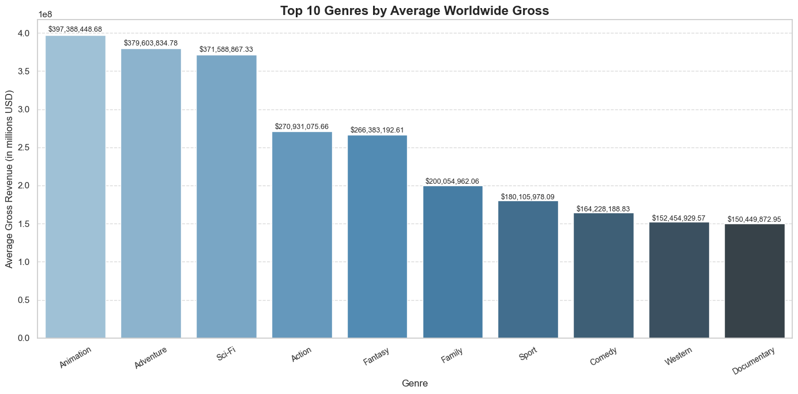
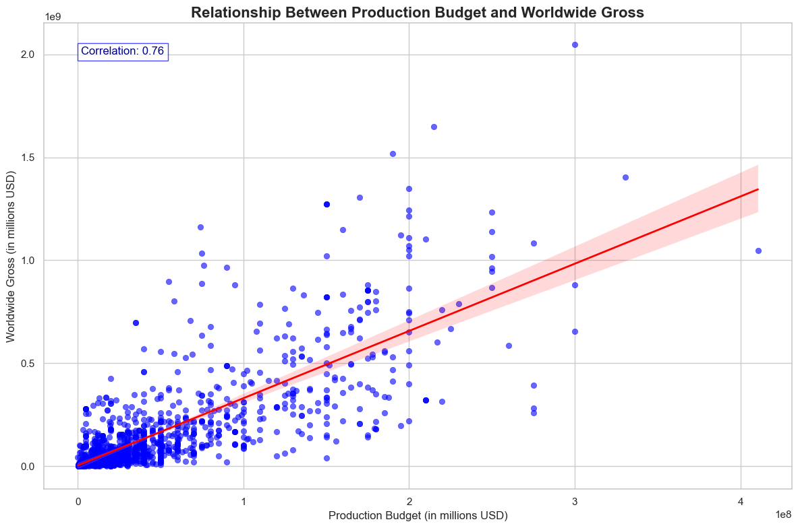
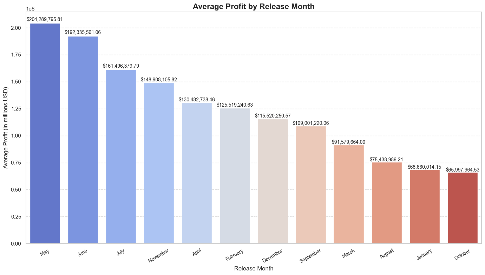

# **Movie Analysis Project**


## **Table of Contents**
1. [Project Overview](#project-overview)  
2. [Key Insights and Visualizations](#key-insights-and-visualizations)  
   - [Profit Margins by Studio](#profit-margins-by-studio)  
   - [Budget vs. Profit Margin](#budget-vs-profit-margin)  
   - [Average Revenue by Genre](#average-revenue-by-genre)  
   - [Revenue by Release Month](#revenue-by-release-month)  
   - [Revenue by Original Language](#revenue-by-original-language)  
   - [Audience Ratings vs. Revenue](#audience-ratings-vs-revenue)  
3. [Interactive Features](#interactive-features)  
4. [Accessing the Dashboard](#accessing-the-dashboard)  
5. [Future Enhancements](#future-enhancements)  
6. [Acknowledgments](#acknowledgments)  

---


### Project Overview  

In my Movie Analysis project, I aimed to uncover pivotal insights into the movie industry by addressing key questions, including:  

- Which genres consistently generate the highest revenue?  
- How do budgets correlate with worldwide gross?  
- What are the most profitable release windows for movies?  
- How do audience ratings influence box office success?  
- Which studios have the highest profit margins?  
- Does the original language of a movie influence its global performance?  

My objective was to provide stakeholders with actionable, data-driven insights to guide strategic decisions in movie production and distribution.  

---

### Data Understanding  

To answer these questions, I analyzed multiple datasets, merging and cleaning them to create a unified dataset for analysis. The primary datasets I used were:  

- **Box Office Mojo**: Data on box office performance by studio.  
- **The Numbers**: Focused on production budgets and revenues.  
- **Rotten Tomatoes Reviews**: Audience and critic review scores.  
- **Rotten Tomatoes Movie Info**: Metadata, including genres, runtimes, and release dates.  
- **TMDB**: Popularity metrics, genre details, and vote counts.  
- **IMDb Database**: A zipped SQLite database containing `movie_basics` and `movie_ratings` tables for detailed insights into movie ratings and metadata.  

---

### Actions Taken  

- I cleaned and standardized datasets to address missing values and formatting inconsistencies.  
- I merged the relevant datasets to form a consolidated, clean dataset for analysis.  

---

### Key Features in the Data  

- **Revenue Metrics**: Domestic, foreign, and worldwide gross.  
- **Production Metrics**: Budget, profit, and profit margins.  
- **Movie Details**: Genres, runtimes, release dates, and languages.  
- **Audience Insights**: Average ratings and vote counts.  

---

### Questions Answered  

- **What genres should producers invest in?**  
  I found that **Animation**, **Adventure**, and **Sci-Fi** movies consistently generate the highest revenue, with average grosses of $397M, $380M, and $371M, respectively. These genres dominate global markets, making them highly profitable investments for studios.  

- **Does budget guarantee success?**  
  By plotting the relationship between production budgets and worldwide gross, I discovered a strong positive correlation (r = 0.76). Higher budgets generally lead to higher revenue; however, I also observed that profitability depends on spending strategically, as outliers exist where high budgets yielded underwhelming returns.  

- **Which studios have the highest profit margins?**  
  My analysis showed that **UTV** leads with an impressive average profit margin of 30.02%, followed by **WB (NL)** at 13.78% and **FD** at 12.40%. This analysis highlighted the importance of operational efficiency and strategic investments, as studios with smaller budgets can outperform bigger players in profitability.  

- **When should movies be released?**  
  Based on my findings, **May** and **June** are the most lucrative months for movie releases, with average revenues of $204M and $192M, respectively. These months align with blockbuster seasons, including summer and holiday periods, which maximize box office potential. In contrast, months like **October** and **January** have much lower average revenues, indicating a reduced pull during these times.  

- **How do audience ratings affect success?**  
  By examining the correlation between the number of votes and worldwide gross, I found a moderate positive correlation (r = 0.57). Movies with higher audience engagement (reflected in the number of votes) tend to perform better at the box office, suggesting that audience approval and buzz contribute significantly to success.  


- **How does a movie's original language influence revenue?**  
  My analysis showed that English-language movies dominate global revenue. However, I observed that some non-English movies have begun gaining traction in niche markets, proving that strategic storytelling can transcend language barriers.  

---

### Graphs and Visualizations  

1. **Relationship Between Production Budget and Worldwide Gross**  
   I created a scatter plot that revealed a strong positive correlation between production budgets and worldwide gross revenue. The regression line illustrated that, while higher budgets often lead to higher revenue, profitability depends on strategic allocation of resources.  

2. **Top 10 Studios by Profit Margin (ROI)**  
   I visualized the profit margins of the top 10 studios, showing that **UTV** leads with an average ROI of 30.02%. This visualization highlighted the importance of efficient budgeting and strategic operations in maximizing profitability.  

3. **Number of Votes vs. Worldwide Gross**  
   I analyzed how audience votes correlate with worldwide revenue. The scatter plot showed that movies with more audience votes tend to generate higher box office revenue, suggesting that audience engagement is a critical driver of financial success.  

4. **Average Revenue by Genre**  
   My analysis revealed that **Animation**, **Adventure**, and **Sci-Fi** are the highest-earning genres globally, making them key investments for studios aiming for large-scale returns.  

5. **Revenue by Release Month**  
   I created a bar chart to explore seasonal trends, which confirmed that movies released in **May** and **June** generate the highest average revenues, while those in **October** and **January** underperform.  

---

### Tools and Technologies Used  

- **Python**: For data cleaning, analysis, and visualizations.  
- **Tableau**: For creating interactive dashboards.  
- **Libraries**: Pandas, Seaborn, Matplotlib, and others for statistical and graphical analysis.  

---

### Interactive Dashboards  

Using Tableau, I developed dashboards to allow stakeholders to:  

- Explore genre-specific revenue trends.  
- Identify optimal release windows.  
- Compare studio profitability.  
- Understand the impact of audience ratings on revenue.  
📂 **Access the Tableau Workbook**: *(Insert link here)*

---

## **Files in Repository**
| **File Name**                   | **Description**                                      |
|---------------------------------|----------------------------------------------------|
| zippeddata folder               | Dataset used throughout the analysis. |
| `final.ipynb`                   | Jupyter Notebook with code, analysis, and visualizations. |
| `requirements.txt`              | File listing all Python dependencies.             |
| `Movie_insight_Workbook.twb`    | Tableau workbook containing all dashboards.        |
| `movie_insight.pdf`             | pdf of the notebook containing all dashboards.        |
|   images folder                 | all images used in the notebook.        |
---

## **Future Enhancements**
1. **Advanced Predictive Models**:
   - Incorporate techniques like Random Forests or Gradient Boosting for revenue prediction.
2. **Regional Insights**:
   - Include regional box office data for a more comprehensive analysis.
3. **Streaming Platform Trends**:
   - Investigate how streaming services impact box office performance.
4. **Customer Segmentation**:
   - Cluster audiences based on preferences and demographics for targeted marketing.

---

## **Acknowledgments**
This project was inspired by the transformative potential of data in reshaping decision-making in the entertainment industry. Special thanks to:
- The Flatiron School for the foundational dataset.
- The Tableau Public and Python communities for their resources and tools.
```
