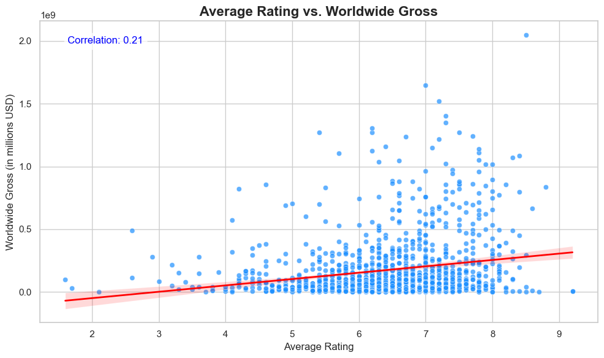

Here is the updated README with the corrected Table of Contents and improved structure:

---

# **Movie Analysis Project**

## **Table of Contents**

1. [Project Overview](#project-overview)  
2. [Data Understanding](#data-understanding)  
3. [Key Insights and Visualizations](#key-insights-and-visualizations)  
   - [Profit Margins by Studio](#profit-margins-by-studio)  
   - [Budget vs. Profit Margin](#budget-vs-profit-margin)  
   - [Average Revenue by Genre](#average-revenue-by-genre)  
   - [Revenue by Release Month](#revenue-by-release-month)  
   - [Revenue by Original Language](#revenue-by-original-language)  
   - [Audience Ratings vs. Revenue](#audience-ratings-vs-revenue)  
4. [Interactive Features](#interactive-features)  
5. [Accessing the Dashboard](#accessing-the-dashboard)  
6. [Future Enhancements](#future-enhancements)  
7. [Acknowledgments](#acknowledgments)  
8. [Files in Repository](#files-in-repository)

---

### 1. **Project Overview**  

In my Movie Analysis project, I aimed to uncover pivotal insights into the movie industry by addressing key questions, including:  

- Which genres consistently generate the highest revenue?  
- How do budgets correlate with worldwide gross?  
- What are the most profitable release windows for movies?  
- How do audience ratings influence box office success?  
- Which studios have the highest profit margins?  
- Does the original language of a movie influence its global performance?  

My objective was to provide stakeholders with actionable, data-driven insights to guide strategic decisions in movie production and distribution.

---

### 2. **Data Understanding**  

To answer these questions, I analyzed multiple datasets, merging and cleaning them to create a unified dataset for analysis. The primary datasets I used were:  

- **Box Office Mojo**: Data on box office performance by studio.  
- **The Numbers**: Focused on production budgets and revenues.  
- **Rotten Tomatoes Reviews**: Audience and critic review scores.  
- **Rotten Tomatoes Movie Info**: Metadata, including genres, runtimes, and release dates.  
- **TMDB**: Popularity metrics, genre details, and vote counts.  
- **IMDb Database**: A zipped SQLite database containing `movie_basics` and `movie_ratings` tables for detailed insights into movie ratings and metadata.  

---

### 3. **Key Insights and Visualizations**  

Here are the key insights from the analysis, along with visualizations that illustrate the findings:

#### **Profit Margins by Studio**
- **UTV** leads with an impressive average profit margin of 30.02%, followed by **WB (NL)** at 13.78% and **FD** at 12.40%. This analysis highlights the importance of operational efficiency and strategic investments.  

#### **Budget vs. Profit Margin**
- A strong positive correlation was found between production budgets and worldwide gross (r = 0.76). However, profitability depends on strategic spending, as some high-budget movies underperformed.  

#### **Average Revenue by Genre**
- **Animation**, **Adventure**, and **Sci-Fi** are the highest-grossing genres, with averages of $397M, $380M, and $371M, respectively. These genres are great investments for studios.  

#### **Revenue by Release Month**
- **May** and **June** are the most lucrative months for movie releases, generating an average of $204M and $192M, respectively. Conversely, **October** and **January** have much lower revenues.  

#### **Revenue by Original Language**
- English-language films dominate global box office revenue, though non-English films are beginning to perform well in niche markets.  

#### **Audience Ratings vs. Revenue**
- A moderate positive correlation (r = 0.57) was observed between audience votes and worldwide gross, indicating that higher engagement contributes to better box office performance.  

---

### 4. **Interactive Features**  

Using Tableau, I developed interactive dashboards that allow stakeholders to explore the following:

- Genre-specific revenue trends.  
- Optimal movie release windows.  
- Studio profitability comparisons.  
- The impact of audience ratings on revenue.  

📂 **Access the Tableau Workbook**: *(Insert link here)*

---

### 5. **Accessing the Dashboard**  

To access the dashboard, download the **Tableau Workbook** from the repository and open it in Tableau Desktop or Tableau Public. This will allow you to explore the various visualizations and interact with the data to gain insights.

---

### 6. **Future Enhancements**  

Future work on this project may include:

1. **Advanced Predictive Models**:
   - Incorporating machine learning techniques such as Random Forests or Gradient Boosting to predict movie revenues.
   
2. **Regional Insights**:
   - Including box office data for different regions to understand local trends and factors influencing movie success.

3. **Streaming Platform Trends**:
   - Investigating how the rise of streaming services impacts box office performance and viewing habits.

4. **Customer Segmentation**:
   - Clustering audiences based on demographics and preferences to allow for more targeted marketing strategies.

---

### 7. **Acknowledgments**  

This project was inspired by the transformative potential of data in reshaping decision-making in the entertainment industry. Special thanks to:

- The Flatiron School for providing the foundational dataset.  
- The Tableau Public and Python communities for their resources and tools.

---

### 8. **Files in Repository**  

| **File Name**                   | **Description**                                      |
|----------------------------------|-----------------------------------------------------|
| `zippeddata` folder             | Dataset used throughout the analysis.               |
| `final.ipynb`                   | Jupyter Notebook with code, analysis, and visualizations. |
| `requirements.txt`              | File listing all Python dependencies.               |
| `Movie_insight_Workbook.twb`    | Tableau workbook containing all dashboards.         |
| `movie_insight.pdf`             | PDF of the notebook containing all dashboards.      |
| `images` folder                 | All images used in the notebook and visualizations. |

--- 

